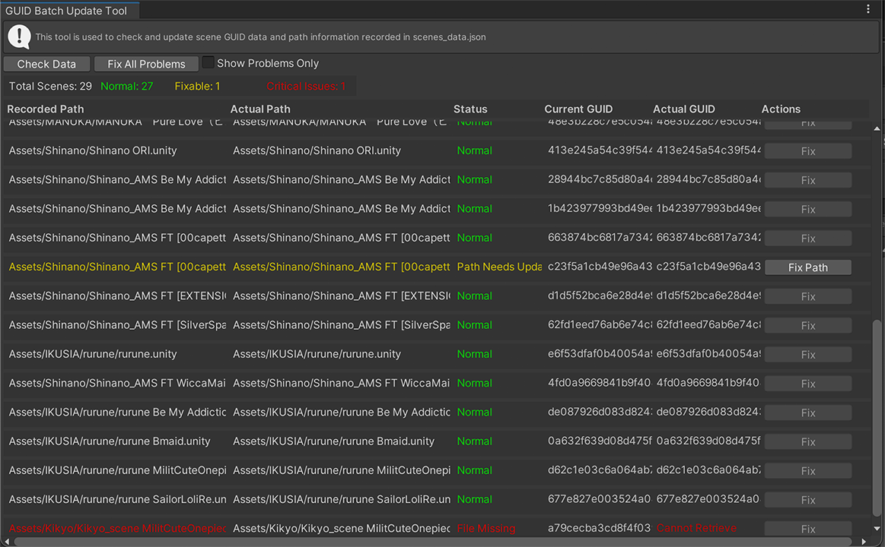

# GUID 一括更新ツール  GUID管理

## 使用シーン

- 定期チェック：「すべてのGUIDをチェック」をクリックし、統計と問題レポートを表示
- ファイル名変更後：「問題項目のみ表示」にチェックを入れ、「すべての問題を修復」を実行
- プロジェクト移行後：データを更新し、GUID 問題が存在するかチェック
- 個別修復：対象行の「修復」をクリック

-----

## ツールを開く

- ショートカット：メインウィンドウ上部の青い「GUIDツール」ボタンをクリック
- メニューパス：`Tools → CYN-lab → AvatarSceneBrowser → GUID Batch Update Tool`

## インターフェースと機能

### ボタンと色

- ①　データをチェック：`scenes_data.json` を再読み込みして分析
- ②　すべての問題を修復：検出された GUID とパスの問題を修復
- ③　問題項目のみ表示：問題のあるエントリのみフィルタリング

| 状態 | 色 | 説明 | 処理| 
|------|------|------|-----|
| **正常** | 🟢 緑色 | GUIDが正しく、ファイルが存在、処理不要 | |
| **更新が必要** | 🟡 黄色 | GUIDがない/現在のGUIDと実際のGUIDが一致しない、更新が必要 | |
| **ファイル欠損** | 🔴 赤色 | Sceneファイルが存在しない、削除または移動された可能性 | |

>赤色エラーの場合、MainWindowのプレビュー画面に警告が表示されます
>

#### データ列の説明

| 記録パス | 実際のパス | 状態|現在のGUID | 実際のGUID | 操作|
|------|------|------|------|------|------|

## 注意事項

- 一括修復前に `scenes_data.json` のバックアップを推奨
- 確認ダイアログは慎重に読んでください
- 🟡 黄色 は開くことに影響しません

