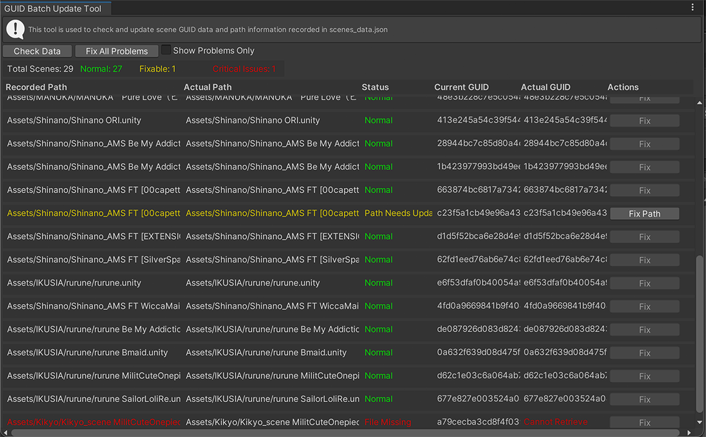
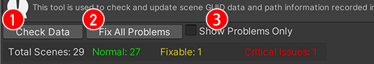
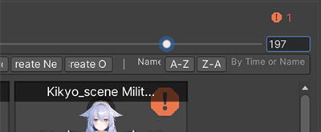

# GUID 批量更新工具  GUID管理

>检测：文件存在性 / GUID 有效性 / GUID 一致性
>
>修复：从 AssetDatabase 获取正确 GUID → 更新 `scenes_data.json` → 重建基于 GUID 的结构 → 保存

## 使用场景

- 定期检查：点击“检查所有GUID”，查看统计与问题报告
- 文件重命名后：勾选“仅显示问题项”，执行“修复所有问题”
- 项目迁移后：刷新数据并检查是否存在 GUID 问题
- 单个修复：在目标行点击“修复”

-----

## 打开工具

- 快捷方式：在主窗口顶部点击蓝色“GUID工具”按钮
- 菜单路径：`Tools → CYN-lab → AvatarSceneBrowser → GUID Batch Update Tool`

## 界面与功能

### 按钮与颜色

- ①　检查数据：重新加载并分析 `scenes_data.json`
- ②　修复所有问题：修复检测到的 GUID 与路径问题
- ③　仅显示问题项：过滤出有问题的条目

| 状态 | 颜色 | 说明 |
|------|------|------|
| **正常** | 🟢 绿色 | GUID正确，文件存在，无需处理 |
| **需更新** | 🟡 黄色 | 如无GUID/当前GUID与实际GUID不匹配，需要更新 |
| **文件缺失** | 🔴 红色 | Scene文件不存在，可能已被删除或移动 |

>当红色错误的时候MainWindow预览界面会出现警告
>

#### 数据列说明

| 记录路径 | 实际路径 | 状态|当前GUID | 实际GUID | 操作|
|------|------|------|------|------|------|

## 注意事项

- 建议在批量修复前备份 `scenes_data.json`
- 确认对话框请认真阅读
- 确保具备项目目录写入权限

## 技术要点

- 检测：文件存在性 / GUID 有效性 / GUID 一致性
- 修复：从 AssetDatabase 获取正确 GUID → 更新 `scenes_data.json` → 重建基于 GUID 的结构 → 保存

