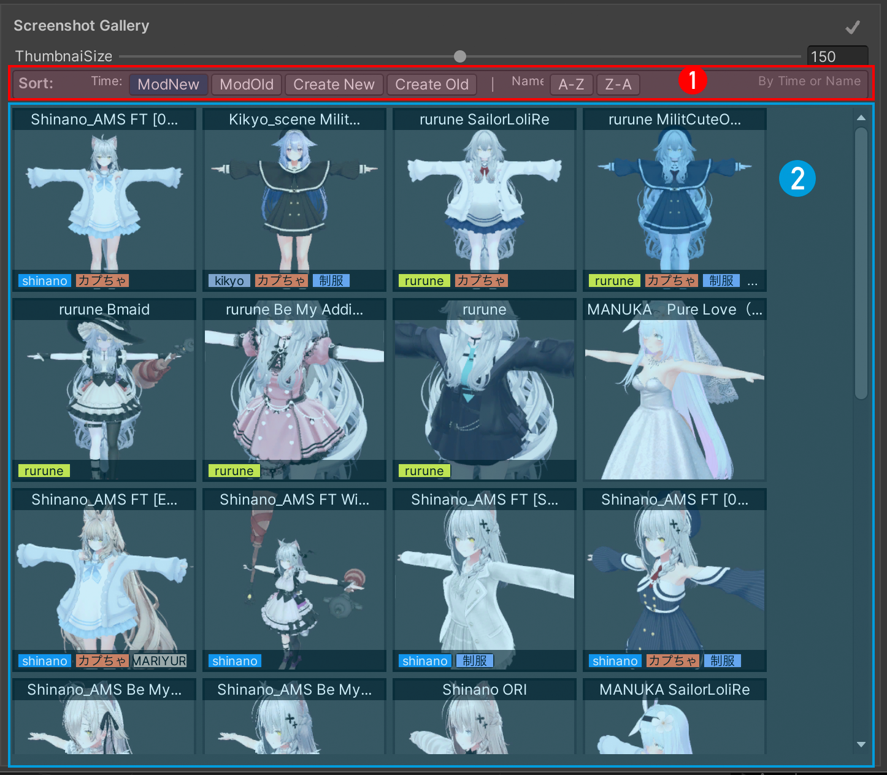

# メインウィンドウ

## 中央エリア

Avatar Scene Browser 中央の表示エリア

① スクリーンショット並び替え機能

!!! info " 現在の時間並び替え機能は、スクリーンショット作成時間に基づいて並び替えられます。unitySceneの更新時間による並び替えはまだ実装されていません"

② スクリーンショット表示エリア

!!! info " ダブルクリックで開くことができます"

---

① sceneの名前

② tag表示エリア

③ エラー表示

- ファイルの欠損、詳細は[GUIDツール](guid-batch-update-tool.md)

---

## 右側の詳細情報

### 小ボタン

① unity projectでsceneファイルを特定

② システムのファイルエクスプローラーでunity sceneファイルの場所を開く

③ このスクリーンショットのjpg/pngとjson内のデータを削除（復元不可）
tagそのものをクリアする場合は[タグ管理](tag-manager.md)を使用してください

