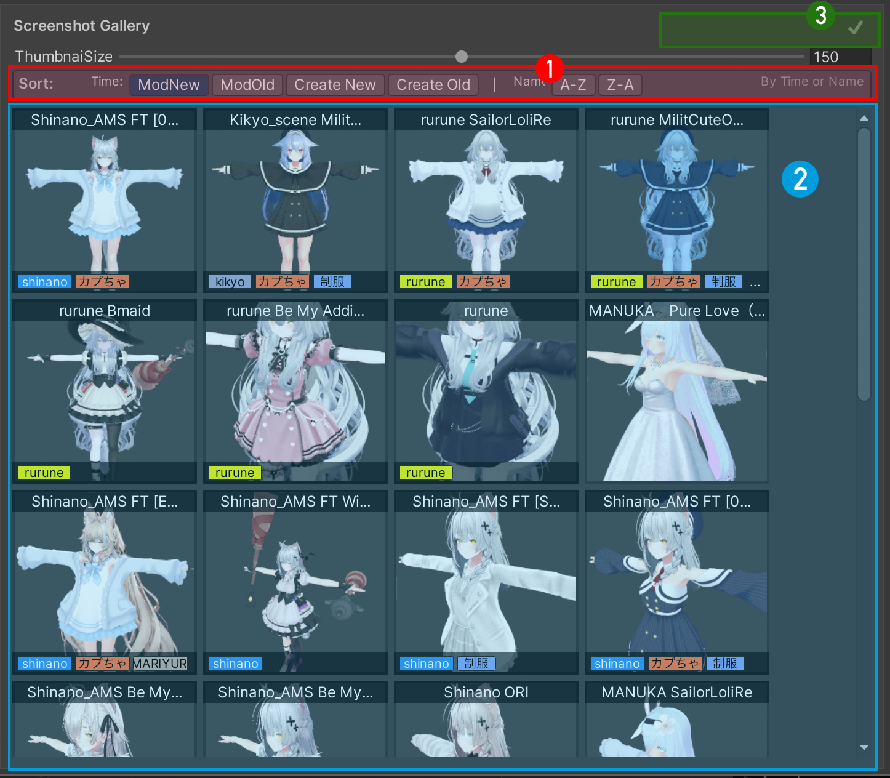
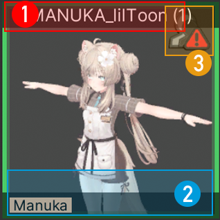
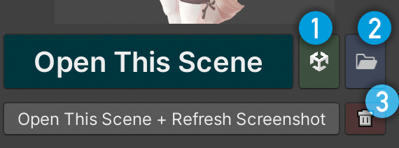

# 主窗口

## 标题栏

标题栏右侧会显示当前错误状态：

- 🔴 数字（单个人形图标）：有场景文件丢失
- 🔴 数字（多个人形图标）：有 Avatar 数据异常（仅对当前打开的场景有效）
- ✅：无异常

---

## 中间区域（截图画廊）

截图画廊中并排显示所有已保存的截图缩略图。

**两种缩略图类型：**

- **蓝色边框**：普通场景截图（0～1个 Avatar 的场景）
- **绿色边框**：Avatar 配置截图（场景内有多个 Avatar 时，每个配置单独显示）

① 截图排序功能（按截图时间或名称排序）

!!! info "排序说明"
    排序以截图创建/修改时间为基准，暂不支持按 Unity Scene 文件的更新时间排序。

② 截图显示区域

!!! info "支持双击打开场景"

---

### 单个缩略图

① Scene 的名字（Avatar 配置截图则显示 Avatar 名称）

② 标签显示区域

③ 错误显示

- 红色 ! 图标：文件丢失或 Avatar 数据异常，详情参见 [GUID 工具](guid-batch-update-tool.md)

---

## 右键菜单

在缩略图上右键可以快速操作：

- 🚀 打开场景
- 🔄 刷新截图
- 📁 在 Unity 项目窗口中显示
- 📂 在文件浏览器中显示
- 🏷️ 清除所有标签
- ⚠️ 删除截图数据

---

## 右侧详细信息

选中一个场景或 Avatar 配置后，右侧面板会显示详细信息。

### 小按钮

① 在 Unity 项目窗口里定位 scene 文件

② 在系统文件浏览器中打开该文件所在位置

③ 删除截图数据（不可恢复；不会删除 Unity 场景文件本身）

---

## Avatar 配置面板（多 Avatar 功能）

当选中的场景有多个 Avatar 配置时，右侧详情面板下方会出现 **Avatar 配置** 区域。

- 每行代表一个已保存的 Avatar 显示状态配置
- ★ 单个 Avatar 配置（绿色）
- ◆ 多个 Avatar 同时激活的组合配置（橙色）
- ▶ 按钮：加载此配置，自动恢复对应 Avatar 的显示/隐藏状态
- ✕ 按钮：删除此配置

!!! tip "如何创建 Avatar 配置"
    在 Hierarchy 中调整好想要的 Avatar 显示状态后，点击工具栏截图按钮即可自动保存为一个新配置。