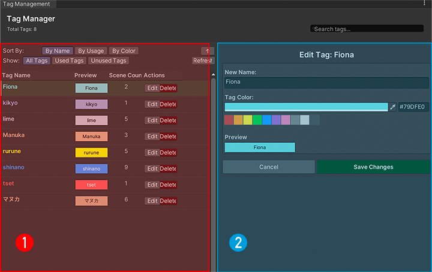

# 标签管理器

## 开启标签管理器

有两种方式可以打开标签管理器：

1. **通过主窗口**：在Avatar Scene Browser主窗口的标签筛选区域，点击 `管理标签` 按钮
2. **通过场景详情**：选择某个场景后，在右侧详情面板点击标签管理相关按钮

## 界面布局

标签管理器采用左右分栏的设计：

- **①tag浏览**：标签列表，包含搜索、排序和筛选功能
- **②侧面板**：编辑区域，显示编辑界面或空闲提示

### 标签删除

点击 `删除` 按钮可以删除标签：

- 删除操作不可撤销，请谨慎操作

## 注意事项

1. **标签名称修改**：修改标签名称会自动更新所有使用该标签的场景
2. **数据保存**：所有标签修改都会自动保存到json文件中
