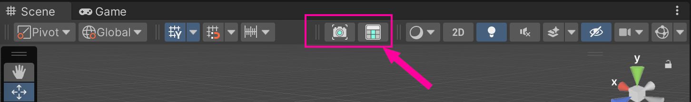

# クイック使用ガイド
-------
# まずスクリーンショットから始める

インポート後、Sceneウィンドウ上部のツールバーにボタンが表示されます





- Scene ウィンドウのツールバーにあるスクリーンショットボタンをクリック
   
{ width="80" }
--
   - または Unity メニューから `Tools > Avatar Scene Browser > Open Browser` を選択
       - `現在開いているシーンのスクリーンショットを更新` ボタンを使用

   


## シーンのスクリーンショット表示エリア
キャプチャした Scene の画面がここに配置表示されます。
[詳細](main-window.md)


## タグを追加

- 右側の詳細パネルでタグを追加できます
- タグの編集については[タグ管理](tag-manager.md)を参照してください

--------

# シーンを開く

Avatar Scene Browser は、複数の便利なシーンの開き方をサポートしています：

### 1. **詳細パネルの「開く」ボタンから**  
   - スクリーンショット一覧でシーンを選択し、右側の詳細エリアで【このシーンを開く】ボタンをクリックすると、対応するシーンファイルを直接開くことができます。

### 2. **シーンサムネイルをダブルクリックして素早く開く**  
   - スクリーンショット表示エリアで、任意のシーンのサムネイルを直接ダブルクリックすると、即座にそのシーンにジャンプして読み込むことができます。

### 3. **右クリックメニューの「シーンを開く」**  
   - シーンサムネイルを右クリックすると、コンテキストメニューが表示されます。【シーンを開く】オプションを選択すると開くことができます。  
   - 右クリックメニューは他の操作もサポートしています（パスのコピー、エクスプローラーで表示など）。

---
詳細は：[メインウィンドウの紹介](main-window.md)


### GUID管理

[GUID管理ウィンドウ](guid-batch-update-tool.md)


--------

# unityメニュー

```
Tools
└── CYN-lab
    └── AvatarSceneBrowser
        ├── Main Window              # メインウィンドウ - シーンの閲覧と管理
        ├── GUID Batch Update Tool   # GUID 一括更新ツール
        └── Screenshot Settings...   # スクリーンショット形式/品質設定
```

### 1. Main Window（メインウィンドウ）
**メニューパス**：`Tools → CYN-lab → AvatarSceneBrowser → Main Window`

**機能**：
- シーンスクリーンショットの閲覧
- タグ管理とフィルタリング
- シーンのクイックオープン（ダブルクリックに対応）
- スクリーンショットの更新と管理
- 多言語サポート

**用途**：日常的なシーン管理と閲覧。


### 2. GUID Batch Update Tool（GUID 一括更新ツール）
**メニューパス**：`Tools → CYN-lab → AvatarSceneBrowser → GUID Batch Update Tool`

**機能**：
- `scenes_data.json` 内の GUID 状態をチェック
- GUID/パス問題の一括修復
- 個別シーンの GUID 修復
- シーンファイル状態の監視と統計

**用途**：GUID データのメンテナンスと修復、システムの安定性確保。
詳細は[GUID一括更新ツール](./guid-batch-update-tool.md)を参照してください。

### 3. Screenshot Settings...（スクリーンショット設定）
**メニューパス**：`Tools → CYN-lab → AvatarSceneBrowser → Screenshot Settings...`

**機能**：
- スクリーンショット形式の切り替え（PNG / JPEG）
- JPEG 品質の設定
- 保存前に同名の異なる拡張子（.meta を含む）をクリーンアップし、単一バージョンを保持


