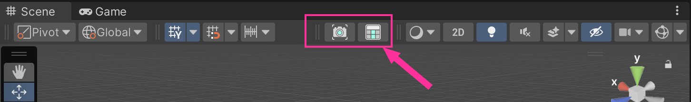
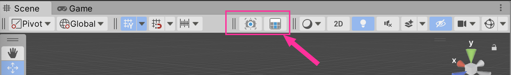
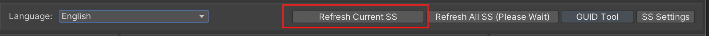

# 快速开始

---

## 第一步：截图

导入后，Scene 窗口上方的 Toolbar 会出现两个按钮。




点击截图按钮即可为当前场景拍摄缩略图：

{ width="80" }

或者通过顶部菜单手动刷新：

`Tools → CYN-lab → VRCAvatarSceneBrowser → Main Window`

然后在主窗口中点击 **刷新当前打开的 Scene 截图**。



---

## 第二步：查看截图库

截取的 Scene 画面会在中间区域排列显示。

[→ 主窗口详情](main-window.md)

---

## 第三步：打开 Scene

支持多种方式打开场景：

1. **双击缩略图** — 最快捷的方式
2. **右键缩略图 → 打开场景**
3. **选中场景 → 点击右侧"打开此场景"按钮**

---

## 第四步：添加标签

选中场景后，在右侧详情面板可以为其添加 Tag。

标签的编辑和管理请参见 [标签管理](tag-manager.md)。

---

## 多 Avatar 场景的使用

如果一个 Unity 场景中包含多个 VRChat Avatar，可以为每种显示状态单独保存截图：

1. 在 Hierarchy 中，只显示你想截图的那个 Avatar（其他隐藏）
2. 点击工具栏截图按钮 → 自动识别并保存为 **Avatar 配置截图**（绿色边框）
3. 对其他 Avatar 重复以上操作

恢复 Avatar 状态：

- 点击绿色边框的缩略图选中配置
- 在右侧 **Avatar 配置** 区域点击 ▶ 按钮 → 自动切换 Avatar 的显示/隐藏

!!! info "注意"
    Avatar 配置功能需要 VRChat SDK（VRCSDK3）才能完整运行。不安装 SDK 的情况下，截图功能仍可正常使用。

---

## Unity 菜单

```
Tools
└── CYN-lab
    └── VRCAvatarSceneBrowser
        ├── Main Window              # 主窗口
        ├── GUID Batch Update Tool   # GUID 批量更新工具
        └── Screenshot Settings...   # 截图格式/质量设置
```

### Main Window（主窗口）
日常的场景管理和浏览。

### GUID Batch Update Tool（GUID 批量更新工具）
当场景文件被重命名或移动后，用于修复数据关联。[→ 详情](guid-batch-update-tool.md)

### Screenshot Settings...（截图设置）
切换截图格式（PNG / JPEG）及设置 JPEG 质量。