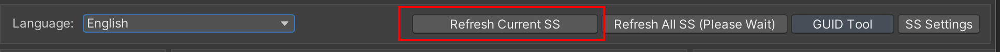

# 快速使用

## 截图

导入后Scene窗口上方的toolbar会出现按钮


- 点击 Scene 窗口工具栏中的截图按钮
   
{ width="80" }
--
   - 或者在 Unity 菜单中选择 `Tools > Avatar Scene Browser > Open Browser`
       - 使用按键 `刷新当前打开的Scene截图`

   


### 主要功能

- **截图预览** - 截取unity Scene的画面制作预览
- **标签系统** - 为场景添加标签，支持多标签筛选和管理
- **GUID管理** - 为了防止重命名或移动场景文件丢失数据，基于Unity GUID系统
- **截图排序** - 对截图排序排序


### 截图预览
截取的Scene的画面制在这里显示作预览


### 标签系统

1. 切换到 `Scenes` 选项卡


### 截图排序

1. 使用顶部的筛选器按类别或标签筛选资源


## 运行时使用

以下是在运行时使用 Avatar Scene Browser 的基本方法：


--------

## unity菜单

```
Tools
└── CYN-lab
    └── AvatarSceneBrowser
        ├── Main Window              # 主窗口 - 场景浏览和管理
        ├── GUID Batch Update Tool   # GUID 批量更新工具
        └── Screenshot Settings...   # 截图格式/质量设置
```

### 1. Main Window（主窗口）
**菜单路径**：`Tools → CYN-lab → AvatarSceneBrowser → Main Window`

**功能**：
- 场景截图浏览
- 标签管理和筛选
- 场景快速打开（支持双击）
- 截图刷新与管理
- 多语言支持

**用途**：日常的场景管理和浏览。


### 2. GUID Batch Update Tool（GUID 批量更新工具）
**菜单路径**：`Tools → CYN-lab → AvatarSceneBrowser → GUID Batch Update Tool`

**功能**：
- 检查 `scenes_data.json` 中的 GUID 状态
- 批量修复 GUID/路径问题
- 单个场景 GUID 修复
- 场景文件状态监控与统计

**用途**：维护和修复 GUID 数据，确保系统稳定性。
请参见[GUID批量更新工具](./guid-batch-update-tool.md)

### 3. Screenshot Settings...（截图设置）
**菜单路径**：`Tools → CYN-lab → AvatarSceneBrowser → Screenshot Settings...`

**功能**：
- 切换截图格式（PNG / JPEG）
- 配置 JPEG 质量
- 保存前清理同名不同扩展（含 .meta），保持单一版本


如果问题仍然存在，请[提交问题]并提供详细的错误信息。